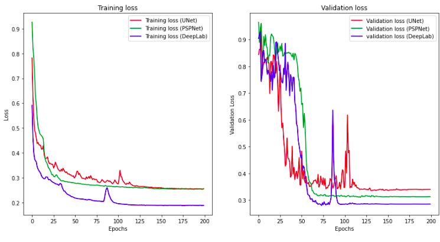

# Semantic Segmentation with Scene Description

## Table of Contents
* [Semantic Segmentation](#semantic-segmentation)
* [Image Captioning](#image-captioning)
* [Video Segmentation](#video-segmentation)
* [Notes](#notes)

## Semantic Segmentation

### Dataset
Download the [Kitti semantic dataset](http://www.cvlibs.net/datasets/kitti/eval_semseg.php?benchmark=semantics2015). Extract the dataset in the `data` folder.  This will create the folder `data_semantics` with all the training and test images.

### Models 
#### 1. UNET

   This is the general view of u-net architecture:   
   

#### 2. PSPNET

   This is the general view of pspnet architecture:   
   

#### 3. DEEPLAB

   This is the general view of deeplab architecture:   
   

### 

### Results 

   

   

   

## Image Captioning

## Video Segmentation

## Notes
* To replicate and run this code you just need to run it on google colab.
* Upload the dataset to your drive and make sure to change the directory in the notebook to the new one.
